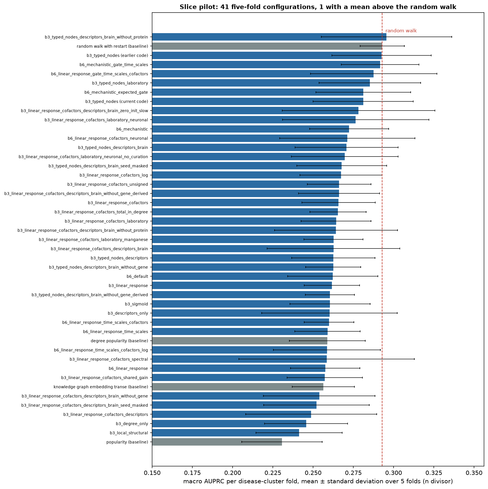
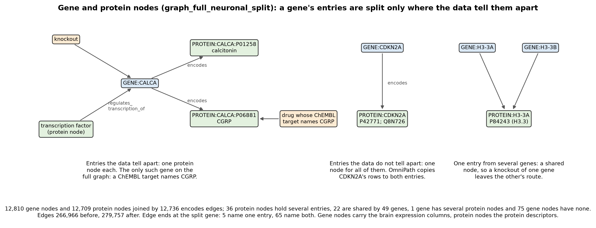
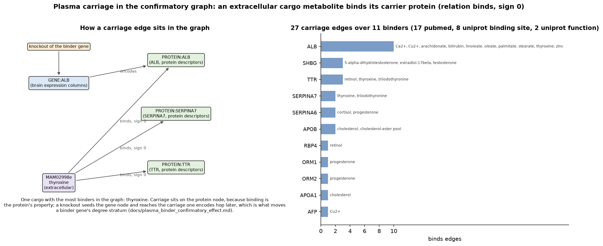

# Explanatory figures (updated 9 October 2026)

Drawn by experiments/make_explanatory_figures.py from the repository's own outputs (graph tables, summaries and run
results), so each figure can be regenerated after the inputs change. Every result shown is from the monogenic slice,
which is a pilot (docs/preregistration.md, amendment of 7 October); no full-graph model has been scored. No figure
reads a second-family (confirmatory_v2) development score or a lockbox output.

## 1. The model

The two tested models of the second family (docs/confirmatory_runbook.md): the noisy-OR head on each of the two
encoders. The user dropped the sigmoid head on 8 October 2026; it remains in the slice comparisons only. A perturbation
(a gene's loss or gain of function, or a drug's signed effect at its targets) enters as a sustained input at its nodes
in graph_full_neuronal_split_binders, the graph that separates genes from proteins (figure 7) and carries the plasma
carriage edges (figure 8), which is what the two tested configurations read (docs/preregistration.md, amendments of
9 October 2026, first and fourth). The message-passing encoder runs 3 layers of typed messages from node states built
from the structural features and descriptors, one more than on a merged graph because a perturbed gene node reaches its
protein one hop later. The linear-response encoder propagates the input for 8 steps over the signed,
normalised adjacency of each relation, with a learned gain per relation and channel and one channel per cell class
(11 classes and all cells); extracellular pools are shared across classes. Both read the difference field (perturbed
minus unperturbed). A sum over nodes feeds a noisy-OR over pathway modules whose leaks start at their loss-optimal
constants. Labels follow better_v2 (figure 3), folds are grouped by disease cluster and drug targets, lockbox_v2 is held
out, the early-stopping validation set rotates with the seed and each model is refitted on training and validation
together. Node and edge counts are computed from the graph tables when the figure is drawn.

## 2. Cell-class channels

How cell types enter propagation without copying the graph. Each class has its own channel over the same edges, and
in class k every node's response is multiplied by the node's weight in that class at each step. On a six-node chain
with equal gains, class B does not express reaction R1, so a loss of function at gene G stays at G in class B's
channel. Marking product P as a shared extracellular pool makes P hold the mean of the two classes, and the change
made in class A then reaches R2 and Q in class B at half its size. The values are computed by LinearResponseEncoder
itself, untrained. The weights are a node's expression relative to its highest class, x_k / (max_j x_j + 1 nCPM)
(mechanistic_pathway_learning/graph/brain_expression_weights.py). Both linear-response configurations of each family
use these channels with extracellular coupling (--cell-class-weights, --extracellular-coupling); the first family's
fold-0 development pilots ran with them.

## 3. Better (not more) training examples

The better_v2 selection of the tested models, on evidence_full_v2. Gene pairs are kept at HPO frequency 0.30 or more;
drug pairs at label frequency 1 percent or more or when both SIDER and OnSIDES list them. 2,211 of 4,439 positive pairs
are kept. A pair set aside is masked out of the loss and every metric; it is not a negative. better_v2 keeps
better_v1's positive rows and also masks the pairs whose only evidence is grade C (a human association): 777 in the
whole evidence table, 172 of them in the data the trainer loads (preregistration, amendment of 8 October). Before,
those pairs were negatives in scoring and weak negatives in training. Catatonia keeps no pair and psychomotor
retardation keeps 1, so both leave the macro average (5 positives are needed).

## 4. The dopaminergic class

The Human Protein Atlas single-nucleus cluster types have no dopaminergic type, so dopamine neuron markers peak at a
few nCPM in unrelated types (SLC6A3 at 0.6 in splatter neurons). Cluster 395 of the same atlas (Siletti et al. 2023),
summed from 872 nuclei and scaled to HPA's nCPM with a trimmed mean of log ratios, carries TH, SLC6A3 and SLC18A2 at
hundreds of nCPM and GAD1 and AQP4 below 3. Data: CC BY 4.0 (Siletti et al. 2023, via CZ CELLxGENE) and HPA
(CC BY-SA 4.0).

## 5. Slice pilot: one-change comparisons

Every two slice configurations that differ in one argument, both with five finished folds (41 pairs, regenerated on
8 October with the brain-expression descriptor arms and their treatments), read two ways: the pooled out-of-fold
difference in macro AUPRC with a paired bootstrap, and the same after ranking scores inside each degree stratum of
each fold. Dashed lines mark the preregistered minimum difference of 0.05; no interval reaches it. Two pooled intervals
exclude zero, about the 2.1 that 41 uncorrected intervals give by chance, and both are message-passing descriptor
blocks: dropping the gene block scores below dropping the protein block, -0.025 [-0.040, -0.010], and dropping the
gene-derived reaction block scores below it too, -0.030 [-0.046, -0.015]. Three within-strata intervals exclude zero (descriptors in message passing,
-0.020; the same gene-against-protein pair, -0.022; the neuronal graph under the noisy-OR head, -0.019).
docs/twin_comparisons.md has the numbers. The module-fix and gene-and-protein-split arms (runs/module_fix) are read in
docs/module_health_results.md, docs/module_health_fast_leak_results.md and, when split_slice ends, its own document.

## 6. Slice pilot: baselines and models

Per-fold macro AUPRC of the four slice baselines and every five-fold slice configuration of runs/phase3_aggregate.json
(41 configurations). One configuration has a mean above the random walk's 0.293: b3_typed_nodes_descriptors_brain_without_protein
at 0.296, with a fold standard deviation of 0.041 against the walk's 0.014, which no paired comparison has tested. The
amendment of 7 October attributes the trained models' position to the slice's size and single layer rather than to the
mechanism; the slice cannot tell those two apart. b3_typed_nodes appears twice: the earlier run and the rerun under
the current code (runs/encoder/).

## 7. Gene and protein nodes

graph_full_neuronal_split (docs/gene_protein_split.md, with the correction of 8 October on complex accessions). Each
gene node joins its protein node by an encodes edge. A gene's reviewed UniProt entries get separate protein nodes only
where the data tell them apart; on the full graph that is CALCA alone, because a ChEMBL target names CGRP (P06881) and
not calcitonin (P01258). CDKN2A keeps one node for both entries, since OmniPath copies its rows to each. Entries shared
by several genes (H3-3A and H3-3B for H3.3) get one shared node, so a knockout of one gene leaves the other's route.
Knockouts seed gene nodes, drugs seed protein nodes and transcription edges end at genes. Gene nodes carry the brain
expression columns and protein nodes the protein descriptors. Counts are read from split_summary.json when the figure
is drawn.

## 8. Plasma carriage

The 27 `binds` edges of graph_full_neuronal_split_binders (docs/plasma_binder_graph.md), which carry an extracellular
cargo metabolite to the plasma protein that binds it: 19 cargo metabolites over 11 binders, sign 0, from the curated
carriage table (docs/curated_plasma_carriage.csv, each row with a PMID, a DOI and a quoted sentence) and from UniProt
binding-site features. The carriage sits on the protein node, because binding is the protein's property, so no
perturbation's own seed node is touched; a knockout of a binder gene reaches the carriage one `encodes` hop later,
which is why three binder genes that are perturbations change strata degree and two of them, both development rows,
move degree quintile (docs/plasma_binder_confirmatory_effect.md). The left panel takes the cargo with the most binders
in the graph; the right panel counts the edges of each binder and names its cargo. Orosomucoid (ORM1, ORM2) gets one
edge each, progesterone, and not because the rest was missed: its cargo is basic drugs, which this graph has no node
for, so it enters through the fraction unbound of stage 2 (docs/plasma_protein_binding.md) rather than through these
edges.
