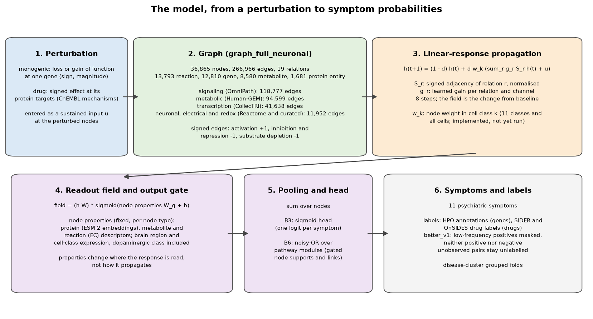
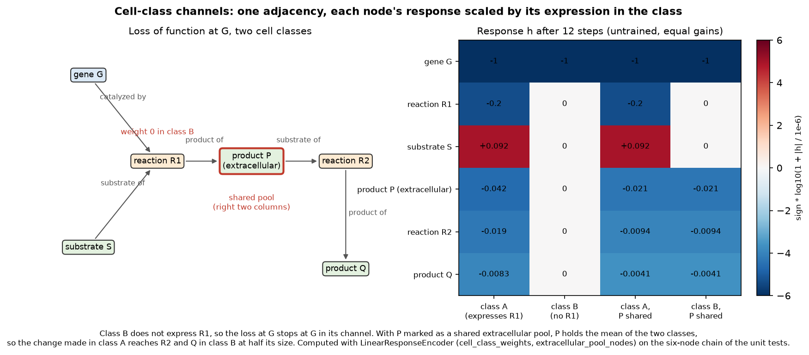
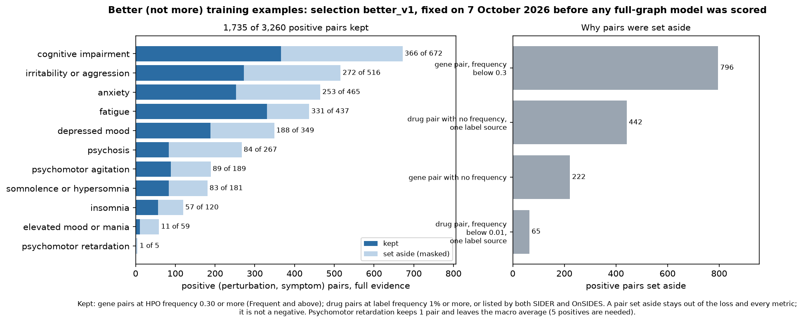
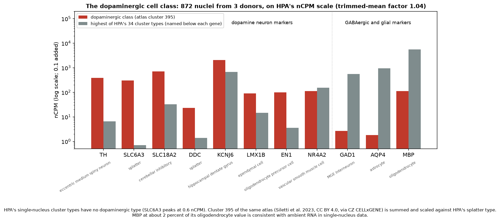
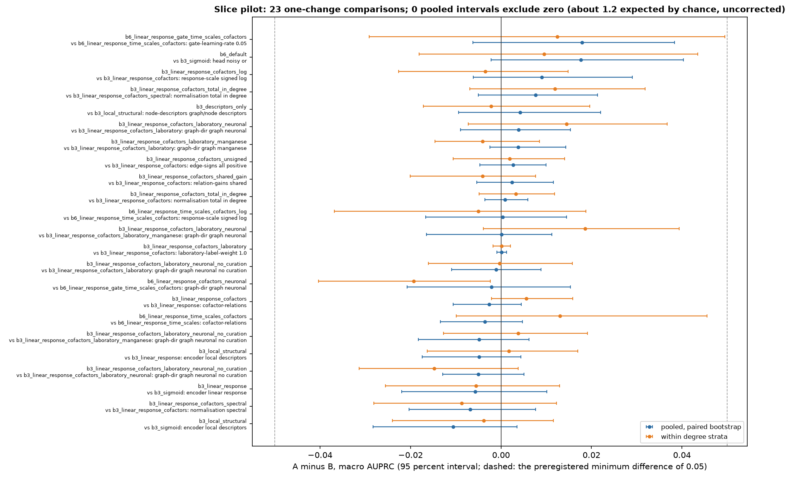

# Explanatory figures (7 October 2026)

Drawn by experiments/make_explanatory_figures.py from the repository's own outputs (graph tables, summaries and run
results), so each figure can be regenerated after the inputs change. Every result shown is from the monogenic slice,
which is a pilot (docs/preregistration.md, amendment of 7 October); no full-graph model has been scored.

## 1. The model

A perturbation (a gene's loss or gain of function, or a drug's signed effect at its targets) enters as a sustained
input at its nodes in graph_full_neuronal. The linear-response encoder propagates it for 8 steps over the signed,
normalised adjacency of each relation with a learned gain per relation and channel. The node properties then gate
where the response is read. A sum over nodes feeds the head: a sigmoid per symptom (B3) or a noisy-OR over pathway
modules (B6). Node and edge counts are computed from the graph tables when the figure is drawn. The cell-class weight
w_k is implemented and tested but has not been used in a run.

## 2. Cell-class channels

How cell types enter propagation without copying the graph. Each class has its own channel over the same edges, and
in class k every node's response is multiplied by the node's weight in that class at each step. On a six-node chain
with equal gains, class B does not express reaction R1, so a loss of function at gene G stays at G in class B's
channel. Marking product P as a shared extracellular pool makes P hold the mean of the two classes, and the change
made in class A then reaches R2 and Q in class B at half its size. The values are computed by LinearResponseEncoder
itself, untrained. The weights are a node's expression relative to its highest class, x_k / (max_j x_j + 1 nCPM)
(mechanistic_pathway_learning/graph/brain_expression_weights.py).

## 3. Better (not more) training examples

The better_v1 selection, fixed before any full-graph model was scored. Gene pairs are kept at HPO frequency 0.30 or
more; drug pairs at label frequency 1 percent or more or when both SIDER and OnSIDES list them. 1,735 of 3,260
positive pairs are kept. A pair set aside is masked out of the loss and every metric; it is not a negative. Most
pairs set aside are gene pairs annotated below Frequent and drug label statements with no frequency. Psychomotor
retardation keeps 1 pair and leaves the macro average; elevated mood or mania keeps 11.

## 4. The dopaminergic class

The Human Protein Atlas single-nucleus cluster types have no dopaminergic type, so dopamine neuron markers peak at a
few nCPM in unrelated types (SLC6A3 at 0.6 in splatter neurons). Cluster 395 of the same atlas (Siletti et al. 2023),
summed from 872 nuclei and scaled to HPA's nCPM with a trimmed mean of log ratios, carries TH, SLC6A3 and SLC18A2 at
hundreds of nCPM and GAD1 and AQP4 below 3. Data: CC BY 4.0 (Siletti et al. 2023, via CZ CELLxGENE) and HPA
(CC BY-SA 4.0).

## 5. Slice pilot: one-change comparisons

Every two slice configurations that differ in one argument, both with five finished folds, read two ways: the pooled
out-of-fold difference in macro AUPRC with a paired bootstrap, and the same after ranking scores inside each degree
stratum of each fold. Dashed lines mark the preregistered minimum difference of 0.05. No pooled interval excludes
zero. One within-strata interval does (the neuronal graph under the noisy-OR head, -0.019 [-0.040, -0.002]), about
what 23 uncorrected intervals give by chance. docs/twin_comparisons.md has the numbers.
